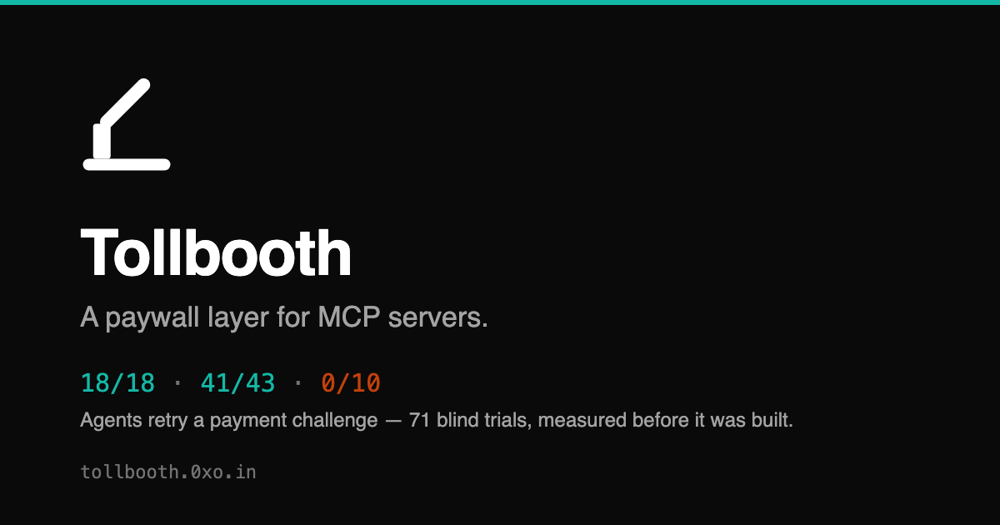
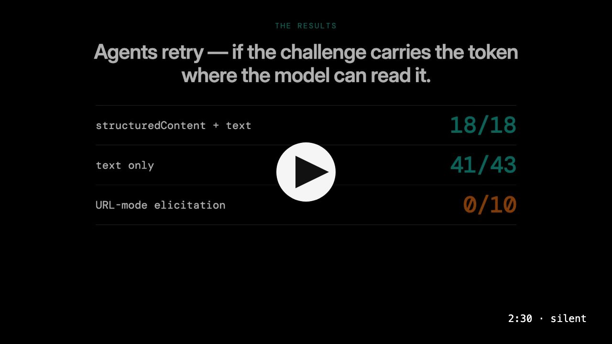

<p align="center">
  
</p>

<h1 align="center">Tollbooth</h1>

<p align="center">
  <strong>A paywall layer for MCP servers.</strong><br>
  An agent calls a paid tool. It gets a payment challenge. A human pays. The agent retries and the tool runs.
</p>

<p align="center">
  <a href="https://tollbooth.0xo.in/docs">Documentation</a> ·
  <a href="https://tollbooth.0xo.in/docs/results">The measurement</a> ·
  <a href="https://tollbooth.0xo.in/docs/quickstart">Quickstart</a> ·
  <a href="https://www.npmjs.com/package/@tollbooth/mcp">npm</a>
</p>

---

Tollbooth does the middle of that loop — the challenge, the handle, the entitlement, the
settlement — and it settles **directly to the tool author's own wallet**. It never holds
anyone else's revenue, because the payment API it builds on has no way to send money
onward. There is nothing to hold and nothing to trust us with.

## The assumption everything rests on

No protocol guarantees an agent will come back after a human pays. So it was measured
before anything was built: 71 blind two-turn trials against a real client, with the
challenge delivered three different ways.

<!-- measured:SHAPES (generated from site/content/measurements.ts) -->
| Challenge shape | n | retried | token exact | delivered |
| --- | ---: | ---: | ---: | ---: |
| `structuredContent + text` | 18 | 18 | 18 | **18 (100%)** |
| `text only` | 43 | 41 | 41 | **41 (95%)** |
| `URL-mode elicitation` | 10 | 0 | 0 | **0 (0%)** |
<!-- /measured:SHAPES -->

Elicitation scores zero for a structural reason, not a client bug: MCP's `-32042` is a
JSON-RPC *error*, so it ends the call and there is nowhere for a handle to ride. Tollbooth
encodes that in its types — a renderer that cannot carry the handle cannot be a
challenge's token bearer.

[**The full method, the sample sizes, and everything still unmeasured →**](https://tollbooth.0xo.in/docs/results)

## Watch

<p align="center">
  <a href="https://tollbooth.0xo.in/#watch">
    
  </a>
</p>

<p align="center"><sub>Two and a half minutes, silent. Every figure on screen comes from the same file the site reads.</sub></p>

## Quickstart

<!-- snippet:RUN (generated from site/content/snippets.ts) -->
```bash
git clone https://github.com/Jagadeeshftw/tollbooth
cd tollbooth
npm install
npm run build

export MOOVE_API_KEY=mk_live_...
# Only if your key names a different host. Do not guess it.
# export MOOVE_API_BASE_URL=https://api.moove.xyz

node examples/research-tools/dist/stdio.js
```
<!-- /snippet:RUN -->

Or put a paywall in front of a tool of your own:

<!-- snippet:TOOL (generated from site/content/snippets.ts) -->
```ts
server.paidTool(
  'fetch_readable',
  'Fetch a web page and return its readable text.',
  { sku: 'research', cost: 1 },   // an expensive tool can cost more
  { url: z.string() },
  { readOnlyHint: true },
  async (args) => readable(String(args.url))
);
```
<!-- /snippet:TOOL -->

## How it works

1. **The agent calls a paid tool.** No handle yet, so nothing is charged.
2. **The tool returns a challenge, immediately.** A checkout URL and a payment handle, in
   the tool result where the model can read them. It never blocks — a human takes 30
   seconds to minutes, and MCP clients time out at 60.
3. **A human pays.** They open the link and pay in whatever token they already hold, on
   whatever chain they already use. No account, no signup, no KYC.
4. **The agent retries with the handle.** The charge settles exactly once, the entitlement
   is granted, and the tool runs.

## Why Moove

The payer needs a wallet and nothing else — no Moove account, no signup, no KYC — and can
pay from any of 37 chains in whatever token they already hold, which Moove routes to the
settlement token the tool author chose. For a payment link the author receives the full
amount: the 0.02% protocol fee is the payer's, and same-chain, same-token is free.

Most of all, a link settles straight to the author's own wallet. That is what makes
"Tollbooth never holds your revenue" a property of the design rather than a promise.

## What is in here

Six packages are published on npm at `0.1.x`. Three are private: they serve the others and
have no life of their own outside this repository.

| Package | | |
| --- | --- | --- |
| [`packages/core`](packages/core) | `@tollbooth/core` | The entitlement model — prices, charges, entitlements, settlement policy. No payment provider, no MCP. |
| [`packages/mcp`](packages/mcp) | `@tollbooth/mcp` | The MCP binding: `withPaywall` and `paidTool`, and the challenge renderers. Includes the [trial harness](packages/mcp/harness) that produced the measurement. |
| [`packages/moove`](packages/moove) | `@tollbooth/moove` | The Moove payment provider: checkout links, polling, exactly-once settlement. |
| [`packages/store-sqlite`](packages/store-sqlite) | `@tollbooth/store-sqlite` | Durable SQLite entitlement store. The local default. |
| [`packages/store-postgres`](packages/store-postgres) | `@tollbooth/store-postgres` | Durable Postgres store, built for Neon. What a deployment uses. |
| [`packages/gateway-client`](packages/gateway-client) | `@tollbooth/gateway-client` | Opt-in telemetry for the hosted dashboard. Nothing else depends on it, and the library works with no Tollbooth account. |
| [`packages/store-conformance`](packages/store-conformance) | private | The behaviour every store must have, run against all three backends. |
| [`packages/gateway-server`](packages/gateway-server) | private | The dashboard's backend: sign-in, tenants, ingest, and the row-level security behind it. |
| [`packages/design`](packages/design) | private | The design tokens and the mark every surface renders from. |

And the things that are not libraries:

| | |
| --- | --- |
| [`examples/research-tools`](examples/research-tools) | A real paid MCP server — three tools, real payments, deployed. The quickstart and the SSRF-hardening reference. |
| [`dashboard/`](dashboard) | The hosted gateway's web dashboard: revenue, settlement outcomes and usage for a server built on Tollbooth. |
| [`site/`](site) | The landing page and documentation. [`site/content/measurements.ts`](site/content/measurements.ts) is the single source for every number this project states anywhere. |
| [`video/`](video) | The explainer above, as Remotion source. Its figures are imported from a generated copy of that same file, so a number on screen cannot drift from the measurement. |
| [`scripts/`](scripts) | The guards CI runs — dependency boundaries and generated-copy drift — and the logo asset build. |

**`site/` and `video/` are not npm workspaces.** They each have their own `package.json`
and lockfile, so the root `npm install` does not touch them — `cd site && npm install` or
`cd video && npm install` to work on either. The packages, the example and the dashboard
are workspaces and install together.

## Checks

```bash
npm run check   # dependency boundaries, generated-copy drift, typecheck, tests
```

CI runs exactly that on Node 20, 22 and 24 against a real Postgres. The two guards encode
decisions rather than style: `core` may not import a payment provider or MCP, nothing may
depend on the gateway client, and every generated copy must match its source.

One client is still unmeasured. [`DESKTOP-TEST.md`](DESKTOP-TEST.md) is a five-minute
protocol for Claude Desktop, with each outcome's meaning written down before the run
rather than after it.

Published on npm at `0.1.x`, pre-1.0: the API can still change. MIT.
